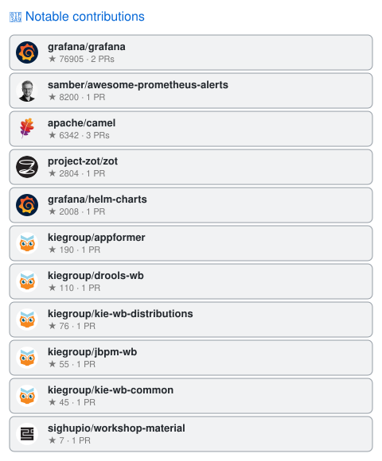

# 👋 Hi, I'm Marco Pernigo (gjed)

**DevOps, Microservices & Observability at [Zextras](https://github.com/zextras)**

## 🧑‍💻 About Me

- 🛠️ **DevOps Engineer & Former Full Stack Developer** — 5 years in full stack
  development, now a DevOps jack of all trades: always learning, always experimenting.
- 🚀 Day job: release engineering and packaging for
  [Carbonio](https://github.com/zextras), CI on Jenkins and k3s, and keeping the
  observability stack honest.
- 🧑‍🔬 Night job: a homelab where I tinker, break things, and fix them again to
  keep my curiosity satisfied.

## 🛠️ Skills & Tools

- **System Administration** (Linux, networking, shell scripting)
- **Virtualization & Orchestration** (Proxmox, QEMU, Kubernetes/k3s)
- **Observability** (Grafana, Prometheus, Loki, Tempo, OpenTelemetry)
- **Microservices Development** (Java, Apache Camel, Go)
- **CI/CD & Automation** (Jenkins, Docker, Ansible, Terraform, Python)
- **Packaging & Release Engineering** (deb/rpm, JFrog Artifactory, semantic-release)
- **Security Assessment Automation** (OWASP ZAP, Python scripting)

## 📊 Metrics

> "Jack of all trades, master of none, but oftentimes better than a master of one."
